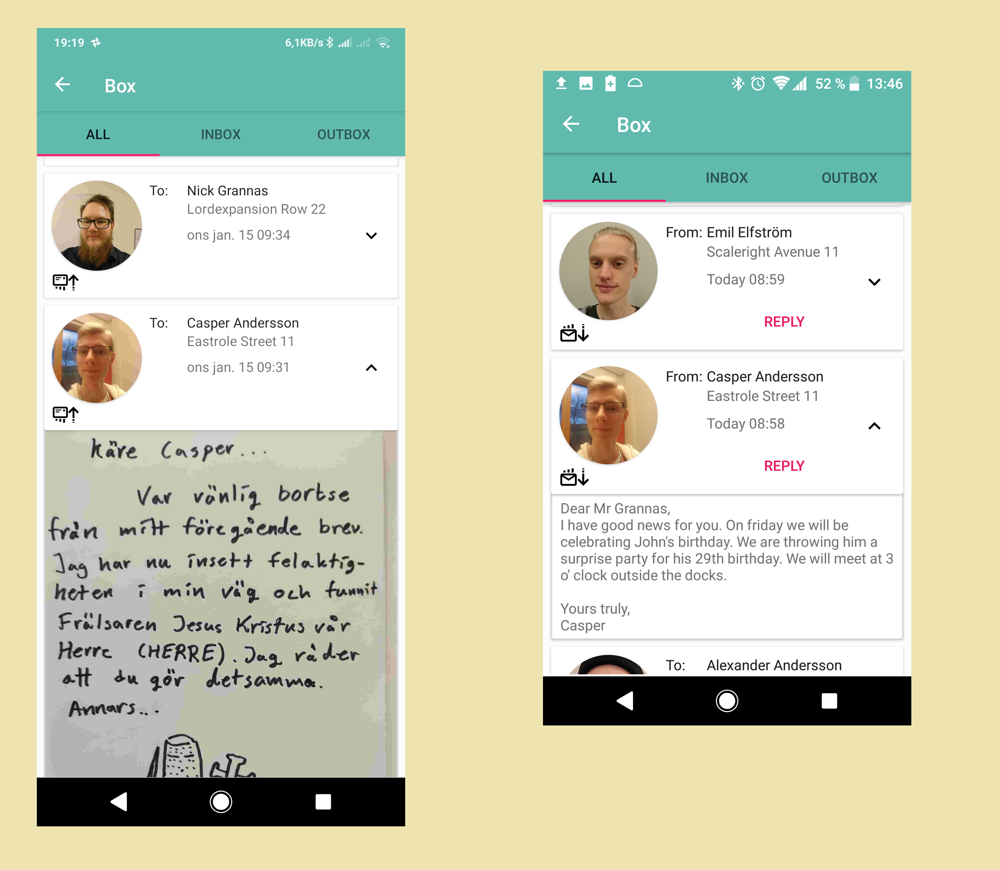
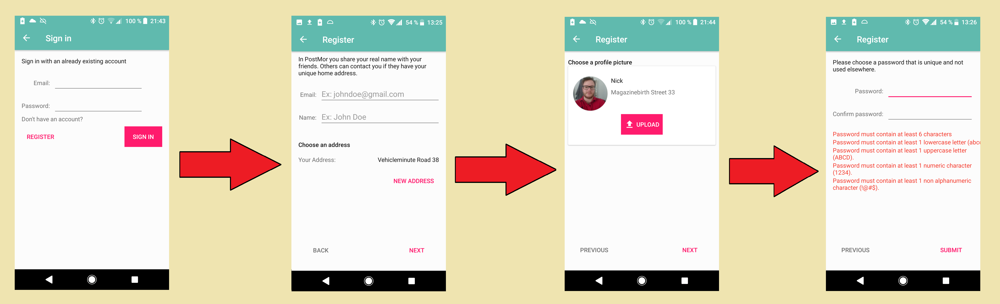
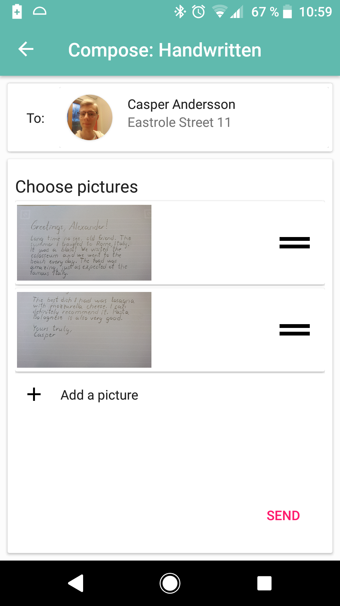

# PostMor
An app for sending handwritten mail in a way that imitates physical mail. The user writes a letter on paper and sends it via the app to someone else. The letters are delivered to their “home address” which is a fake online address. The deliveries and emptying of post-boxes are done on set times each day and delivery takes a few days. 

Our app will provide a new (old) medium for communication where the stress of replying instantly does not affect the user in a negative way. Just like with sending real letters there will be time to sit down and compose an answer. The users will have a sense of pride and accomplishment after sending a letter, and a feeling of joy when they receive a letter.

The target audience are people interested in the charm of old fashioned mail, such as elderly and hipsters. 
# Images
Simplified structure

The home screen

The box screen

The compose screen

The contacts screen

